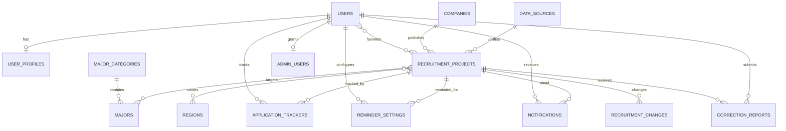

# 校招雷达第一版产品设计

## 1. 产品信息架构

```text
校招雷达（siteConfig.name，可通过 system_configs 配置）
├── 公开内容
│   ├── 首页 / 总览
│   ├── 招聘信息列表
│   ├── 招聘详情
│   ├── 招聘日历
│   ├── 关于平台
│   └── 来源与免责声明
├── 登录用户空间
│   ├── 求职资料
│   ├── 我的招聘（收藏 + 报名状态 + 备注）
│   ├── 消息中心
│   └── 提醒设置
└── 管理员空间
    ├── 数据看板
    ├── 招聘信息管理
    ├── 企业管理
    ├── 专业管理
    ├── 来源管理
    ├── 批量导入
    ├── 用户纠错管理
    ├── 用户管理
    ├── 系统配置
    └── 操作日志
```

当前站点已经覆盖总览、列表、详情、日历、我的招聘、消息、求职资料、运营后台和关于平台等关键路径；真实认证、API 持久化与定时任务按本文档中的接口和表结构接入。

## 2. 页面结构与核心交互

| 页面 | 主要模块 | 关键操作 |
| --- | --- | --- |
| `/` 总览 | 今日新增、正在招聘、7天内截止、与我匹配、热门企业 | 搜索、进入列表、打开详情、收藏 |
| `/projects` 招聘信息 | 搜索、状态/类型/地区/匹配筛选、项目卡片 | 查看详情、收藏 |
| `/projects/:id` 招聘详情 | 招聘简介、时间、专业匹配、来源核验、跟进状态 | 官方报名、收藏、设置提醒、备注、纠错 |
| `/calendar` 招聘日历 | 月视图、开始报名、报名截止、我的跟进 | 点击事件打开详情 |
| `/my-projects` 我的招聘 | 收藏、报名状态、备注、近期截止 | 更新报名状态、取消收藏 |
| `/messages` 消息中心 | 报名开始/截止/变更提醒 | 标记已读、管理提醒 |
| `/profile` 求职资料 | 毕业年份、学历、专业三级选择、地区偏好 | 保存资料、更新匹配 |
| `/admin` 管理后台 | 项目管理、来源健康度、系统配置 | 新增/编辑/下架/批量导入/处理纠错 |

## 3. 专业匹配规则

匹配只用于信息筛选，不代表报名资格。规则按优先级从高到低计算：

1. `不限专业`：招聘项目 `noMajorLimit = true`，返回“不限专业”。
2. `明确匹配`：用户具体专业存在 `recruitment_project_majors` 中，或出现在标准专业标签中。
3. `专业大类匹配`：用户专业所属学科门类出现在招聘项目的标准专业大类中。
4. `可能匹配`：项目标记接受相关专业，且招聘原文包含“相关专业”等宽泛表述。
5. `暂无匹配依据`：无法从公开招聘原文建立匹配依据。

前台使用 `getMatch(project, userMajor)` 做信息筛选匹配；生产环境将同一规则下沉到服务端，避免用户篡改资料后影响查询边界。

详情页统一展示：

> 专业匹配结果仅供信息筛选参考，是否符合报名条件请以招聘单位官方审核结果为准。

## 4. 信息状态与提醒

- `upcoming`：尚未到报名开始时间。
- `recruiting`：当前时间处于报名窗口内。
- `ending`：距离报名截止不超过 `system_configs.recruitment_cutoff_days`，默认 7 天。
- `closed`：已过报名截止时间。

站内提醒由每日 Cron 任务生成，任务只负责产生 `notifications`，邮件/短信/微信为可替换的发送适配器：

```text
cron/check-recruitment-window
  → 查询收藏 + reminder_settings
  → 去重检查 notifications
  → 生成开始报名 / 截止前7/3/1天 / 信息变更通知
  → 站内消息中心展示
```

## 5. 信息来源与展示原则

| 级别 | 来源 | 默认规则 |
| --- | --- | --- |
| A级 | 企业官方招聘网站、政府官方网站 | 可直接公开，定期核验 |
| B级 | 企业官方公众号、官方招聘账号 | 核对主体和链接后公开 |
| C级 | 高校就业网站转载 | 建议保留原始出处并核验 |
| D级 | 第三方平台、用户提交 | 管理员核实后公开 |

前台项目仅展示已整理并保留官方来源链接的招聘信息，同时显示来源级别、最近核验时间和平台免责声明。自动采集、页面变化和 Excel 导入数据必须先进入原始采集审核流程，不会直接发布。

## 6. ER 设计（逻辑关系）



## 7. 核心数据表字段

详尽 Drizzle 定义位于 `db/schema.ts`。核心表字段如下：

| 表 | 关键字段 |
| --- | --- |
| `users` | `id`, `email`, `phone`, `password_hash`, `last_login_at`, 时间戳、软删除 |
| `user_profiles` | `user_id`, `graduation_year`, `degree`, `major_id`, `other_major`, `preference_types`, `accept_nationwide`, `accept_any_major`, `reminder_preference` |
| `companies` | `id`, `name`, `short_name`, `logo`, `company_type`, `industry`, `official_website`, `recruitment_website`, `status` |
| `recruitment_projects` | `company_id`, `source_id`, `project_name`, `category`, `batch`, `intro`, `graduation_years`, `degree_requirements`, `original_major_text`, `major_categories`, `no_major_limit`, `accepts_related_major`, `published_at`, `start_at`, `deadline`, `announcement_url`, `application_url`, `status`, `last_verified_at` |
| `majors` | `category_id`, `name`, `code`, `aliases`, `sort_order` |
| `major_categories` | `name`, `code`, `sort_order` |
| `regions` | `parent_id`, `name`, `code`, `sort_order` |
| `recruitment_project_majors` | `project_id`, `major_id`, `match_weight` |
| `recruitment_project_regions` | `project_id`, `region_id` |
| `favorites` | `user_id`, `project_id`, 时间戳 |
| `application_trackers` | `user_id`, `project_id`, `status`, `note` |
| `reminder_settings` | `user_id`, `project_id`, `on_start`, `before_days`, `on_change` |
| `notifications` | `user_id`, `project_id`, `type`, `title`, `body`, `read_at`, `scheduled_for`, `sent_at` |
| `recruitment_changes` | `project_id`, `changed_by`, `change_type`, `before_data`, `after_data` |
| `correction_reports` | `project_id`, `user_id`, `type`, `content`, `status`, `reviewed_by`, `reviewed_at` |
| `data_sources` | `name`, `level`, `source_url`, `publisher`, `last_checked_at` |
| `admin_users` | `user_id`, `role` |
| `system_configs` | `key`, `value`, `description` |

查询索引重点覆盖：项目状态 + 截止时间、企业、发布时间、专业名、地区、用户通知未读状态、纠错状态。重要业务表都提供 `deleted_at` 软删除字段。

## 8. API 接口清单

### 认证与用户

| 方法 | 路径 | 说明 |
| --- | --- | --- |
| `POST` | `/api/auth/email/register` | 邮箱注册 |
| `POST` | `/api/auth/email/login` | 邮箱密码登录 |
| `POST` | `/api/auth/phone/send-code` | 预留：发送手机验证码 |
| `POST` | `/api/auth/phone/login` | 预留：手机号验证码登录 |
| `POST` | `/api/auth/logout` | 退出登录 |
| `GET` | `/api/me` | 当前用户与资料 |
| `PUT` | `/api/me/profile` | 保存求职资料 |

### 招聘与匹配

| 方法 | 路径 | 说明 |
| --- | --- | --- |
| `GET` | `/api/projects` | 支持 `q/status/companyType/region/degree/match/publishedBefore/deadlineBefore/noMajorLimit` 筛选 |
| `GET` | `/api/projects/:id` | 详情、来源、变更记录、当前用户匹配结果 |
| `GET` | `/api/projects/:id/match` | 返回五种匹配等级及解释 |
| `GET` | `/api/calendar?month=2026-08` | 返回开始、截止与收藏跟进事件 |
| `POST` | `/api/projects/:id/corrections` | 登录用户提交纠错 |

### 个人招聘清单与提醒

| 方法 | 路径 | 说明 |
| --- | --- | --- |
| `PUT/DELETE` | `/api/projects/:id/favorite` | 收藏 / 取消收藏 |
| `PUT` | `/api/projects/:id/tracker` | 保存报名状态与备注 |
| `GET` | `/api/my-projects` | 我的收藏与报名状态 |
| `PUT` | `/api/projects/:id/reminders` | 开启开始/截止/变更提醒 |
| `GET` | `/api/notifications` | 消息中心分页查询 |
| `PUT` | `/api/notifications/:id/read` | 标记已读 |

### 管理员

| 方法 | 路径 | 说明 |
| --- | --- | --- |
| `GET` | `/api/admin/dashboard` | 项目、来源、纠错与提醒统计 |
| `POST/PUT/DELETE` | `/api/admin/projects[/:id]` | 项目新增、编辑、软删除 |
| `POST` | `/api/admin/projects/import/preview` | CSV/Excel 导入校验与预览 |
| `POST` | `/api/admin/projects/import/commit` | 提交已确认的导入批次 |
| `GET/PUT` | `/api/admin/corrections[/:id]` | 查看和审核用户纠错 |
| `GET/PUT` | `/api/admin/config` | 配置产品名称、毕业年份、截止阈值、招聘类别 |
| `GET` | `/api/admin/audit-logs` | 操作日志 |

所有 `/api/admin/*` 需服务端校验 `admin_users` 权限；外部链接只允许 `https`，并在跳转前展示域名确认提示。

## 9. 项目目录结构

```text
app/
├── data.ts                    # 可配置产品名、规则与已核验招聘项目
├── page.tsx                   # 第一版前台与运营后台交互
├── layout.tsx                 # metadata 与中文根布局
├── globals.css                # 响应式视觉系统
└── api/                       # 下一阶段按接口清单添加 Route Handlers
db/
├── schema.ts                  # PostgreSQL + Drizzle 核心表、索引、枚举
└── seed.ts                    # 官方专业目录与正式招聘项目导入入口
drizzle/
└── 0000_initial_school_radar.sql
docs/
└── product-design.md         # 信息架构、ER、API、规则和任务拆分
public/                       # favicon 与静态资源
.env.example                  # 本地/部署环境变量示例
```

## 10. 开发任务拆分

### 第一阶段：基础能力

- [x] 产品名配置项、基础页面壳和响应式视觉系统
- [x] PostgreSQL/Drizzle 数据表、枚举、索引和软删除设计
- [ ] 邮箱注册、登录、退出与会话
- [x] 求职资料表单与官方专业目录选择
- [ ] 管理员权限中间件、项目 CRUD API

### 第二阶段：招聘信息

- [x] 首页总览、招聘项目卡片和已整理官方来源数据
- [x] 搜索、状态、企业类型、地区、专业匹配筛选
- [x] 详情页、官方入口二次确认、来源等级、核验时间
- [x] 规则匹配展示
- [ ] 服务端分页、URL 校验与真实数据源录入

### 第三阶段：个人跟进

- [x] 收藏、报名状态、备注
- [x] 招聘日历视图
- [x] 消息中心空状态与正式数据接入入口
- [ ] reminder_settings API 与真实站内通知落库
- [ ] Cron 每日检查任务

### 第四阶段：运营后台

- [x] 管理后台数据看板与人工审核空状态
- [ ] CSV/Excel 预览、错误下载、去重导入
- [ ] 信息纠错审核与变更记录
- [ ] 操作日志、用户管理、来源健康度真实统计

## 11. 验收路径

1. 打开首页，确认项目显示来源级别、最近核验时间和免责声明。
2. 搜索“计算机”，进入招聘信息，勾选“只看与我匹配”。
3. 打开项目详情，查看截止时间、匹配等级和官方报名二次确认弹窗。
4. 收藏项目，在“我的招聘”中切换报名状态并保存备注。
5. 打开“招聘日历”，点击事件返回项目详情。
6. 打开“求职资料”，修改专业、学历或地区并返回总览查看匹配数量变化。
7. 打开“管理员后台”，查看项目、来源健康度和系统配置展示。

## 12. 招聘数据采集模块（阶段一）

阶段一新增100家目标单位档案、数据源审计字段、统一安全请求客户端和采集审核队列。所有100家来源初始为 `NEEDS_REVIEW`，不预填未经核验的招聘网址。

采集链路为：

```text
目标单位 → 数据源审计 → 安全请求客户端 → 适配器 → raw_collected_items → 去重/变更检测 → collection_review_tasks → 管理员审核 → opportunities
```

新增的 `lib/collection` 只提供统一类型、安全请求、基础标准化、去重、变更检测、附件白名单和本地解析能力；具体单位的官方入口必须在人工核验后进入 `data_sources`。

阶段一的安全默认值：同域名请求间隔至少10秒、单次最多20次、每天最多100次、最多重试1次、403/429立即停止、连续失败3次降级为 `NEEDS_REVIEW`。不登录、不处理验证码、不绕过反爬、不批量复制第三方聚合平台数据。
